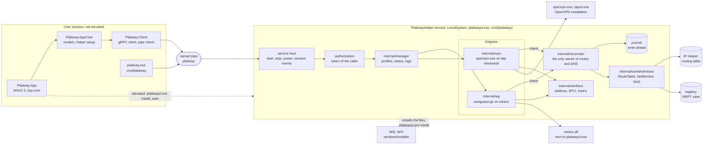

# Plaitway on Windows: architecture

This page says what is where on Windows, who is trusted with what, which parts of the code differ per system, and
which decisions were made on evidence. Every statement comes from the doc comments and tests of the package it names;
where a fact is not known, the page says so. What is verified and what is not is in
[windows-status.md](windows-status.md); the tests that need elevation are in
[windows-elevated-tests.md](windows-elevated-tests.md).

## What is where

| Part | Where | Does |
|---|---|---|
| Interface contract | `proto/plaitway/v1/plaitway.proto` | The only API definition. Generated Go (`internal/gen`), Swift and, at build time, C# code |
| Daemon and service host | `cmd/plaitwayd` | The same binary is the console daemon, the service and the installer of the service (`install`, `uninstall`, `start`, `stop`, `status`). Service details: [packaging/windows/service/README.md](../packaging/windows/service/README.md) |
| Command line client | `cmd/plaitway` | The same commands as on macOS, over the pipe |
| Profile lifecycle | `internal/manager`, `internal/profile` | Stored profiles, on-demand rules, status, logs. Engines and the Reconciler are injected |
| WireGuard engine | `internal/wg` | wireguard-go in the daemon process, adapters made with wintun, named `Plaitway-` and eight hex digits of the profile id's hash, with a GUID derived from the id |
| OpenVPN engine | `internal/ovpn` | The official `openvpn.exe` as a child in a job object, on a TAP-Windows6 adapter that the engine makes with `tapctl`. Details: [packaging/windows/openvpn/README.md](../packaging/windows/openvpn/README.md) |
| Routes and DNS | `internal/reconciler`, `internal/osnet` | The Reconciler is the only caller of `RouteTable` and `DNSConfigurator`. Engines announce a `tunnel.Intent` |
| Windows adapters of `osnet` | `internal/osnet/windows` | Routing table through the IP Helper API, change notifications, NRPT rules in the registry |
| Adapter configuration | `internal/winiface` | Address, MTU, interface metric and the wait for the link of an adapter an engine made. No routes, no DNS |
| Files and trust | `internal/fsperm`, `internal/authenticode`, `internal/peercred`, `internal/transport` | Access lists, signatures, caller identity, the pipe |
| Test safety | `internal/winiface/rootguard`, `scripts/windows` | Guard processes for the elevated tests; the watcher that finds a test listening beyond loopback |
| App | `windows/Sources/Plaitway.App`, `Plaitway.AppCore`, `Plaitway.Client` | See [windows/docs/ui-architecture.md](../windows/docs/ui-architecture.md) |
| Installer | `windows/installer` | WiX project. See the status page for how far it is |

On a machine: the profiles, the Reconciler's journal (`journal`), the run directory (`run`) and the log
(`Logs\plaitwayd.log`) are below `%ProgramData%\Plaitway`, readable by SYSTEM and Administrators. The routes are in the
active store of the routing table and go with a reboot. NRPT rules are keys named `Plaitway-<owner hash>-<generation>-<n>`
below `HKLM\SYSTEM\CurrentControlSet\Services\Dnscache\Parameters\DnsPolicyConfig`, and survive a reboot; `plaitwayd.exe
uninstall` sweeps them. The app keeps credentials in the Credential Manager of the user.

### One connect

1. The app calls `SetProfileEnabled` over the pipe. The daemon reads the token of the caller and checks the call
   against the method's level.
2. The manager starts the profile's engine. The engine makes its adapter, starts the tunnel and announces an
   `Intent`: interface, routes, endpoints that must stay outside the tunnel, DNS servers and domains, the tunnel's own
   next hops.
3. The Reconciler computes one result for all tunnels (priority, shadowing, conflicts with the local network, the
   default route in two halves), writes each change to the journal first, and applies it through `RouteTable` and
   `DNSConfigurator`.
4. The `NetMonitor` reports a changed network; the Reconciler re-reads it, repairs the routes, and then asks the
   engines to rebind.
5. On stop, or on the next start after a crash, the journal says what is still installed.

## Trust model

The daemon runs as LocalSystem and keeps private keys; the app and the command line run as the user. The questions are
who may talk to the daemon, who may change what the daemon trusts, and what each side checks about the other.

**Who may connect.** The pipe is created with this access list (`internal/transport/transport_windows.go`): network
logons are denied first, SYSTEM and Administrators have full control, so does the user the daemon runs as, and
interactive users may read and write. The mask for interactive users leaves out the right to create another instance
of the pipe, so a user cannot serve the pipe next to the daemon. The first instance is created with `FILE_CREATE`,
so an existing pipe of that name is an error (`another process already serves \\.\pipe\plaitway`), and remote clients
are rejected by the pipe's own flag as well.

**Who may do what.** The identity of a caller is the token of the pipe client, read once per connection
(`internal/peercred`): user SID, whether the Administrators group is in the token, the logon session. It is not a
process id. `cmd/plaitwayd/auth.go` has a level for every method, and a method without a level is refused.

| Level | Methods | Caller |
|---|---|---|
| Modify | Import, update, delete and reorder profiles, read a profile's text (it holds keys), remove a stale route | Administrators group enabled in the token, or deny-only: how an administrator's unelevated shell carries it |
| Connect | Daemon info, diagnostics, list, watches, connect and disconnect, credentials, resync | An administrator, or a caller in the logon session at the console. With nobody at the console, a non-administrator is refused |

An identity the system could not read is refused.

**Who may change what the daemon trusts.** `internal/fsperm` keeps the data root, the run directory, the log and the
journal private by a protected access list for SYSTEM and Administrators (and the daemon's own user when it is not
elevated). What is already there is not trusted: an object owned by anyone but SYSTEM, Administrators or the daemon's
account, a junction or symbolic link, and a file with another name than it was opened by are refused rather than
repaired, because `%ProgramData%` lets every user create directories. The service itself is registered with an access
list that gives interactive users the right to read its state only
([packaging/windows/service/README.md](../packaging/windows/service/README.md)). `plaitwayd.exe install` refuses an
executable, or any folder above it, that an account other than SYSTEM, Administrators and TrustedInstaller can change,
and a link, a network share or a removable drive on the way.

**How the client checks the daemon.** Before it sends a byte, the Go client (`internal/transport`) and the C# client
(`PipeServerVerifier`) read the owner of the pipe instance they connected to, and accept SYSTEM, Administrators or the
calling user. The owner is the one property of a pipe that an unprivileged process cannot forge: asking for another
owner when creating a pipe fails. Anything else, and any failure of the check, closes the connection with an error that
starts with `pipe server refused: `. The residual risk is written in the package comment: while the service is down,
another process of the same user can serve the pipe, because an unelevated development daemon is that user's too.

**How the daemon checks OpenVPN and wintun.** Both are run or loaded by a process that is LocalSystem.

- `openvpn.exe` and `tapctl.exe` (`internal/ovpn/trust_windows.go`): the path is absolute; the file is opened without
  write sharing and stays open until the process runs; the file and every folder above it pass
  `fsperm.CheckAdminOnlyPath`; the Authenticode signature is embedded, valid and issued to `OpenVPN Inc.`; and when the
  daemon was built with `-X main.openvpnSHA256=<hash>`, the file has that SHA-256. The check runs before every
  `--version` and every start, so an OpenVPN installed after the service started is picked up and a replaced one is
  refused. A binary that fails is not run, and the reason is `openvpn is not trusted: ...`.
- `wintun.dll` (`internal/wg/wintun_windows.go`): only the one next to `plaitwayd.exe`; opened without write sharing,
  a plain file (no link), signed by `WireGuard LLC`, loaded by its full path and then checked to be the module that
  wireguard-go's lookup by name finds. In service mode the process sets the default DLL search directories to its own
  folder and System32, and its current directory to System32.
- Revocation is not looked up, because the service may start before the network is up
  (`internal/authenticode/doc.go`); a certificate that has expired is accepted when the signature carries a trusted
  timestamp.
- The OpenVPN management interface listens on `127.0.0.1` with a random port and a password; before the password is
  sent, `GetExtendedTcpTable` must say that the child process owns the other end.

**How the app checks the helper before the elevation prompt.** The app never starts the helper silently: it runs
`plaitwayd.exe install -start`, `start`, `install -update -start` and `uninstall` with the `runas` verb, so that Windows
shows the consent prompt, and a declined prompt is a decision, not an error. The file it hands to the prompt is
judged first by `HelperTrustPolicy` (`windows/Sources/Plaitway.AppCore/Helper/HelperTrust.cs`): trusted when every
folder of its path is changeable by administrators only on a local fixed disk, or when its Authenticode signature is
valid and issued to `Plaitway`; otherwise the app shows why and does not launch it. Until the installer and the release
are signed, only the folder rule can be met. After the prompt, `plaitwayd.exe install` applies its own folder rule
again, in the elevated process.

**Secrets.** The daemon keeps credentials in memory and never writes them to disk or to the log. The profiles with
their keys are on disk in the data root, readable by SYSTEM and Administrators only, and returned over the pipe to
administrators only.

**What this does not cover.** Anything that runs elevated can do what the daemon can. A program that was installed
into a folder that only administrators write is trusted by that fact, not by its content. A group policy that delivers
NRPT rules makes Windows ignore the rules of local programs; the daemon says so (`ErrGroupPolicyNRPT`) and does not
claim that DNS is in effect.

## Per-system seams

The Go code that is shared is free of Windows assumptions; what differs is behind files with a system suffix and
behind interfaces. The Linux column says what exists today and what a Linux version supplies. Files tagged `unix` or
`!windows` compile on Linux, but most of them were written for macOS and say so.

| Seam | Defined in | macOS | Windows | Linux |
|---|---|---|---|---|
| `RouteTable` | `internal/osnet/osnet.go` | `osnet/macos`: PF_ROUTE messages | `osnet/windows`: IP Helper (`CreateIpForwardEntry2`), active store only | Supply: netlink routes. A table keyed by destination, interface and next hop, like Windows, is a reason to use `KeyByPrefixInterfaceNextHop` |
| `NetMonitor` | `internal/osnet/osnet.go` | `osnet/macos`: routing socket, `kern.sleeptime` for wake | `osnet/windows`: route, interface and address notifications, power notification | Supply: netlink notifications, suspend and resume |
| `DNSConfigurator` | `internal/osnet/osnet.go` | `osnet/macos`: `scutil` | `osnet/windows`: NRPT rules in the registry, marker `Plaitway-` | Supply: systemd-resolved or `resolv.conf`, with a marker that `Owned` can find after a crash |
| Route keying | `internal/reconciler/keying.go` | `KeyByPrefix` | `KeyByPrefixInterfaceNextHop` | Choose per the table above |
| Wiring | `cmd/plaitwayd/wire_real_*.go` | macOS adapters | Windows adapters | Supply. Today `wire_real_other.go` returns an error and only `-fake` runs |
| Tunnel device and interface configuration | `internal/wg/platform.go` names the functions | `platform_unix.go`: a utun device, `ifconfig.go` runs `/sbin/ifconfig` | `platform_windows.go`, `interfaces_windows.go`: a wintun adapter, `internal/winiface` | Supply: a `platform_linux.go`, and narrow the tag of `platform_unix.go` and `ifconfig.go` to macOS |
| OpenVPN platform | `internal/ovpn/platform_*.go`, `process_*.go`, `trust_*.go`, `device_windows.go` | `platform_other.go`: Unix socket in a private folder, openvpn makes `utun`; hash check plus a copy in the run directory | Loopback TCP with a password, the engine makes the adapter, signature plus admin-only path, job object | `platform_other.go` is the starting point; its device-name rule and its binary trust were written for macOS |
| Service host | `cmd/plaitwayd/service_*.go`, `install_*.go` | launchd runs the console program | Service Control Manager; `install`, `uninstall`, `start`, `stop`, `status` | Supply: a unit file. `service_other.go` and `install_other.go` say there is no host and no subcommand |
| Locations | `cmd/plaitwayd/paths_*.go` | `paths_other.go`: `/Library/Application Support/Plaitway`, `/var/run/plaitway` | `%ProgramData%\Plaitway`, asked of the shell | Supply: its own constants |
| Privilege | `cmd/plaitwayd/privileged_*.go` | `Geteuid() == 0` | The process token is elevated | Exists: `Geteuid() == 0` |
| Caller identity | `internal/peercred/peercred_*.go` | `LOCAL_PEERCRED` | Token of the pipe client | Exists: `peercred_linux.go`, `SO_PEERCRED`, which has no supplementary groups: read them from the account database |
| Console user | `cmd/plaitwayd/auth_owner_*.go`, `auth_session_*.go` | Owner of `/dev/console` | Active console session | Supply: the logind seat or session. `/dev/console` does not name the person at the keyboard |
| Local IPC | `internal/transport` | Unix socket | Named pipe with an access list and an owner check | Exists: the Unix socket |
| Private files | `internal/fsperm` | Mode bits | Protected access list, owner and link checks | Exists: `fsperm_other.go`, mode bits |
| Binary trust | `trustedOpenVPN` in `cmd/plaitwayd/openvpn_*.go`, `internal/authenticode` | SHA-256 and a root-owned copy | Admin-only path, Authenticode, optional SHA-256 | Supply: a package-manager path and a hash or a root-owned copy. `openvpn_other.go` finds the bundle of the macOS app |
| Atomic replace | `internal/profile/replace_*.go`, `internal/reconciler/journal_replace_*.go` | `rename` and a sync of the directory | `MoveFileEx` with replace | Exists: the same as macOS |
| Command line | `cmd/plaitway/editor_*.go`, `terminal_*.go`, `socket_*.go`, `dialfailure_*.go` | `$VISUAL`, `$EDITOR`, termios | `$VISUAL`, `$EDITOR`, then `notepad`; console modes; the pipe name check | Exists: `terminal_other.go` and `editor_other.go`; `stderr_linux.go` carries the terminal request |
| Elevated-test safety | `internal/winiface/rootguard` | The macOS root tests have no guard | Guard processes | Supply: guards for the Linux root tests, if they change state that outlives the process |

Two packages exist only for Windows: `internal/winiface` (it compiles everywhere and returns `ErrUnsupported`) and
`internal/authenticode`. A new system adds a file per row above and does not change the Reconciler, the manager or the
engines' parsing.
## Decisions and their evidence

**DNS is NRPT rules.** Three designs were weighed (`internal/osnet/windows/doc.go`). Per-interface DNS
(`SetInterfaceDnsSettings`) cannot say "only these domains", and the DNS Client still sends a query that no rule matches
to the servers of every adapter (smart multi-homed name resolution), so a full tunnel leaks to the physical network's
resolver; it also needs an interface per entry, which `DNSEntry` does not name. A mix has both problems on the catch-all
side and two places to clean up. NRPT rules send the names a rule matches to the rule's servers and nowhere else,
`.` matches every name, and nothing in a rule refers to an adapter, so no cleanup is tied to an adapter's life. The
layout comes from the strings in `dnsrslvr.dll` and the documented output of `Add-DnsClientNrptRule`; the PC it was
written on had no rule to copy. Open: whether the DNS Client needs `RefreshPolicyEx` after a registry write
(`refreshPolicyAfterChange`, unknown 1 in [windows-elevated-tests.md](windows-elevated-tests.md)).

**OpenVPN runs on tap-windows6.** OpenVPN 2.7 removed Wintun: `DEPRECATED OPTION: windows-driver: In OpenVPN 2.7, the
default Windows driver is ovpn-dco. If incompatible options are used, OpenVPN will fall back to tap-windows6. Wintun
support has been removed`. The engine therefore makes a TAP-Windows6 adapter with `tapctl` and runs `openvpn.exe
--disable-dco --dev-node <adapter>`. ovpn-dco was not chosen: openvpn takes it only when the profile allows it, so the
adapter the engine makes would have to match a choice it cannot see beforehand; a profile with `comp-lzo` and
`AES-128-CBC` never qualifies (packaging/windows/openvpn/README.md).

**A tunnel route has the tunnel's own next hop, or is on-link.** A point-to-point adapter (wintun) takes on-link
routes. An Ethernet-like adapter (tap-windows6) answers only for its gateway's address, so a route bound to the adapter
without a next hop would blackhole while the tunnel is up. `tunnel.Intent` carries `Gateway` and `GatewayV6`; the
Reconciler gives a route the gateway of its family, and a tunnel that names a gateway of one family only carries
nothing of the other except the halves of a default route (`internal/reconciler/keying.go`). The gateway is part of the
route's key and of the journal record.

**Routes are keyed by destination, interface and next hop, and a rival is judged by its effective metric.** Windows
holds several routes to one prefix; the metric is an attribute and not part of the key (documented, confirmed by
`TestRootRouteKeyIgnoresTheMetric` once it runs elevated). Plaitway gives its tunnel routes metric 5 and its bypass
routes to tunnel endpoints metric 1 and never lowers a metric to win. A foreign route to the same prefix with a lower
effective metric (route metric plus interface metric) wins, and so does a more specific one; a tie is not a loss, because
the system breaks it in a way that cannot be read. The route of Plaitway stays, is reported failed with the winner in
the detail (`overridden by ...: effective metric N, ours M`), and is judged again on every network event
(`internal/reconciler/override.go`).

**The default route is only a default if it leaves through a way out.** An interface counts as a way out when it is
not a tunnel or the loopback and is hardware or the adapter of a Hyper-V external switch; the list of known VPN
drivers is a second guard, because Cisco AnyConnect claims to be hardware (`internal/osnet/windows/doc.go`). The cost:
a PC whose only link is virtual has no default route as far as Plaitway can tell.

**The service is LocalSystem, automatic start, with a restart on failure.** Adapters, routes and DNS need it; a
virtual service account and a restricted service SID cannot create adapters or write routes
(packaging/windows/service/README.md, "Not done").

**The installer is an MSI built with WiX.** `windows/installer` holds the WiX project: per machine, one package per
platform for every language (its setup dialog is English; the app chooses its own language), with the payload `plaitwayd.exe`, `plaitway.exe`, `wintun.dll`, the app
and the licenses. The reasons are those of a service that has to be installed, upgraded (stop, replace, `install
-update -start`) and removed (`uninstall`, which keeps `%ProgramData%\Plaitway` because the profiles hold keys) by an
administrator, which is what an MSI does and an unpackaged app does not (windows/docs/ui-toolkit.md).

**The app is WinUI 3, unpackaged.** Evidence and the comparison with WPF are in windows/docs/ui-toolkit.md: it builds
with `dotnet build`, passed the checks on the machine it was decided on, and gives the Windows 11 look and a list that
reorders by dragging without custom code. Unpackaged means no MSIX identity, no startup task from a manifest and no
MSIX update; the Windows App Runtime has to be installed, or the self-contained publish carries it.
