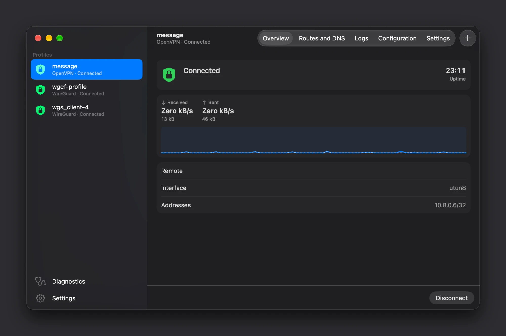

<p align="center">
  
</p>

<h1 align="center">Plaitway</h1>

<p align="center">
  <strong>Several VPNs at once, from one menu bar item.</strong><br>
  Run OpenVPN and WireGuard profiles side by side on your Mac. One component
  owns the routes and DNS, so profiles do not fight over them and a network
  change leaves nothing stale behind.
</p>

<p align="center">
  
  
  
  
  
  
</p>

<p align="center">
  <a href="#getting-started"><strong>Getting started</strong></a>
  · <a href="#what-it-looks-like">What it looks like</a>
  · <a href="#compatibility">Compatibility</a>
  · <a href="#linux">Linux</a>
  · <a href="#technical-reference">Technical reference</a>
</p>

<p align="center">
  
</p>

Plaitway keeps your OpenVPN and WireGuard profiles in the macOS menu bar.
Switch an office network on while a personal WireGuard tunnel stays up, see
which one holds the internet and which one holds `192.168.1.0/24`, and open a
window for the details when something is not working.

It is built on a small root helper and Apple's own `utun` devices — no kernel
extension and no Network Extension. The official OpenVPN and the WireGuard Go
implementation run under the helper, and a single Reconciler decides what goes
in the routing table and in DNS, writes it down, and puts it right again after
a new Wi-Fi network or a changed gateway.

On Linux the same helper runs as a systemd service. The window is a GTK 4 and
libadwaita app with a tray item, tunnels are `tun` devices, routes go through
netlink, DNS through systemd-resolved, and OpenVPN is the distribution's. The
sections down to Getting started were written for the macOS app;
[Linux](#linux) says what differs there.

## What it looks like

The menu bar item is a menu. It says how many profiles are connected and lists
each one with its state; choosing a row connects, disconnects or retries it.

```
Menu bar
├── Connected: 2
├── ✓ Office          OpenVPN · Connected
├── ✓ Home Lab        WireGuard · Connected
│   Café              OpenVPN · Disconnected
├── ──────────────
├── Disconnect All
├── ──────────────
├── Open Plaitway
├── Import Profile…
├── Settings…
└── Quit Plaitway
```

The window is a sidebar, as tall as the window: the profiles at the top and
**Diagnostics** and **Settings** (the app's own, and the helper's) at the bottom.
The page switcher and **+** (import) are at the right of the toolbar;
**Connect** or **Disconnect**, and **Retry** for a profile that failed, are in a
bar at the bottom. Each profile has five pages, also in the **View** menu (⌘1
to ⌘5):

| Page | What it shows |
|---|---|
| **Overview** | The state and why it is so, the uptime, the rate in and out with a two minute graph, what is not in effect, the remote, the interface and the addresses, and a WireGuard profile's public key |
| **Routes and DNS** | Every route and DNS entry the profile asked for, whether it is installed, and for the ones that are not, why: shadowed by a higher priority profile, blocked by the local network, failed |
| **Logs** | The profile's log, following the newest line, filtered by level (debug lines are hidden by default) and searchable |
| **Configuration** | The profile's text, to read and to change |
| **Settings** | The name, auto-connect, tunnel mode, priority, on-demand activation, and for WireGuard leaving the private ranges out |

What a page does that the others do not — the search and level of the log,
**Save** and **Show Secrets** of the configuration — is in a strip at its top,
not in the toolbar. **Diagnostics** has two pages: the overview and the helper's
own log.

Every state has a glyph of its own, a word and a colour — never a colour alone.
The sidebar shows it as a shield, the one the menu bar item uses.

## Several profiles at the same time

Each enabled profile gets its own tunnel. Where they would collide, the
profile higher in the list wins: the sidebar order is the priority, and you
can drag it.

- A **full tunnel** takes the internet. Only one profile holds it at a time;
  the others stand by and say so.
- A **split tunnel** takes just the prefixes its profile names, so
  `192.168.1.0/24` can be the office while the internet goes through
  WireGuard.
- A prefix that **overlaps the network you are on** is blocked and marked as
  such, instead of cutting you off from your own router.
- The address of each VPN server keeps a route outside every tunnel, through
  the physical gateway, so a tunnel never tries to carry itself.

Quitting the app leaves the tunnels up: the helper keeps them, unless you
choose **Disconnect All and Quit**.

## Routes and DNS that clean up after themselves

The helper writes down every route and DNS entry it adds before it adds it. If
it is killed, the next start repairs the table from that journal instead of
trusting what it finds. When the network changes, it compares what the kernel
holds with what it should hold and fixes the difference:

- a new default gateway (Wi-Fi to Ethernet, a phone hotspot) re-points every
  server route within a second; OpenVPN reconnects over the interface it kept
  and WireGuard keeps running
- a wake from sleep is detected and handled the same way
- a route left behind by something else shows up under **Diagnostics ›
  Stale routes**, with a **Remove** button

**Diagnostics** also lists the network, the routes the helper owns, the
resolver entries and the recent changes, and **Copy Report** puts all of it on
the clipboard as plain text for a bug report — without log lines.

## Edit a profile without showing its keys

Both kinds of profile can be edited after they are imported, in the window or
with `plaitway edit`. Private keys and inline key blocks appear as
`‹secret 1›` placeholders until you ask to see them; leave a placeholder where
it is and the secret comes back at save time. The editor has line numbers and
colours for directives and values, and when the helper refuses a text it marks
the line.

A profile that is running keeps the text it started with. **Save** stores the
new text for the next connection; **Save and Reconnect** restarts the profile
with it.

## Connect when the network says so

- **Auto-connect** brings a profile up when the helper starts.
- **On demand** connects a profile while the Mac's primary network is
  Ethernet, Wi-Fi or either, and disconnects it on any other. A connect or a
  disconnect you did by hand holds until the network type changes.
- **Exclude private IPs** (WireGuard) takes the private ranges out of
  AllowedIPs, so the local network stays outside the tunnel while everything
  else goes through. The profile's own DNS servers stay in.

## From the command line

`plaitway` talks to the same helper as the app.

| Command | What it does |
|---|---|
| `status [profile]` | State, interface, addresses, uptime and traffic |
| `list` | Profiles with their ids |
| `connect profile` · `disconnect profile` | Switch a profile on or off; `connect` waits until it is up |
| `import file` | Add a profile from an `.ovpn` or a wg-quick `.conf` |
| `show profile` | The profile's text, secrets hidden unless `-secrets` is given |
| `edit profile` | Change the text in `$VISUAL` or `$EDITOR` |
| `set profile` | Change the name and the settings |
| `remove profile` | Disconnect and delete a profile |
| `logs [profile]` | A profile's log, or the helper's own |
| `diagnostics` · `resync` | The network and the owned routes · rebuild them |
| `watch` | Print profile changes as they happen |

## Bring your profiles

Import `.ovpn` and wg-quick `.conf` files from the window, by dropping them on
it, by opening them with Plaitway in Finder, or with `plaitway import`. The
picker accepts any file: the helper tells an OpenVPN profile from a WireGuard
one by its content.

Profile files are untrusted. Certificates and keys that an OpenVPN profile
names by file are read from the profile's own folder and put inline — any other
path is refused — and the helper rejects directives that read files or run
programs. Usernames and passwords go to the login Keychain.

## Know what the helper may do

The helper runs as root, so it is held to a short list:

- It listens on a Unix socket only, never on the network.
- Every call is checked against who is calling. Connecting and reading are
  open to the person at the console, administrators and root; importing,
  editing and deleting profiles, reading a profile's text (it holds the keys)
  and removing routes are for administrators and root.
- It runs the bundled OpenVPN from its own root-owned directory, after checking
  the binary against the hash baked in at build time, with no scripts.
- Credentials are kept in the helper's memory only and are never logged.

On Linux the rules are the same, with these meanings: an administrator is root
or a member of `sudo`, `wheel` or `admin`; the person at the console is a user
with an active session on a seat of systemd-logind, so a session over SSH is
neither the console nor an administrator unless its user is one; without
logind's state only administrators get in. The helper runs the distribution's
`openvpn` where it is, and only when root owns the file and every directory
above it and nobody else can write to them. The systemd unit restricts the
helper further; [Linux](#linux) lists how.

## In your language

English and 繁體中文, following the system. Messages that come from the helper
itself, such as why a connection is stuck, are in English.

## Getting started

1. Install it with Homebrew, `brew install --cask koukeneko/tap/plaitway`;
   download the dmg or the zip from the
   [latest release](https://github.com/KoukeNeko/Plaitway/releases/latest); or
   build the app yourself (see [Release](#release))
2. Copy `Plaitway.app` to `/Applications` and open it. The first run offers to
   install the helper: **Install Helper**, then allow Plaitway in **System
   Settings › General › Login Items & Extensions**. The app carries on by
   itself once macOS has approved it
3. Import a profile — the **+** in the toolbar, a dropped file, or
   `plaitway import`. If it needs a username and password, the first
   connection asks, and the login Keychain remembers them
4. Choose the profile and press **Connect**, or choose its row in the menu bar
5. Optional: link the command line tool,
   `ln -s /Applications/Plaitway.app/Contents/Resources/bin/plaitway /usr/local/bin/plaitway`

If SMAppService does not accept the helper, `sudo scripts/dev-install-daemon.sh`
installs it as a plain LaunchDaemon and `sudo scripts/dev-uninstall-daemon.sh`
removes it.

**On Linux** (Ubuntu 26.04 or Debian 13, with systemd):

1. Build the package, `make deb`, or take the artifact of the Linux package job
   of the CI. A release does not publish it yet
2. `sudo apt install ./build/linux/plaitway_*.deb`. This installs OpenVPN and
   the GTK libraries, and enables and starts the helper, `plaitwayd.service`
3. Open **Plaitway** from the application menu, or run `plaitway-app`. Import a
   profile with **+**, by dropping the file on the window, or with
   `plaitway import`. A username and password are asked for at the first
   connection, and the Secret Service (GNOME Keyring, KWallet) remembers them
4. Choose the profile and press **Connect**

[Linux](#linux) has the details.

## Compatibility

- macOS 15 or later on Apple silicon; the window uses the macOS 26 and 27
  design where it exists
- **OpenVPN** profiles (`.ovpn`) over UDP or TCP, with the certificates and keys
  inline or beside the file; a username and password, and a key passphrase,
  are asked for when the profile needs them
- **WireGuard** profiles in wg-quick format (`.conf`), IPv4 and IPv6, with
  `Table = off` honoured. An address with a `/0` prefix, such as the
  `192.168.50.0/0` that ASUS routers write for their LAN, is the default route
  as far as WireGuard is concerned, and the import says so
- Profiles that use `pkcs12` or `secret` are refused, and so are directives
  that run programs or read files outside the profile
- Linux with systemd, Ubuntu 26.04 and Debian 13: a kernel with `/dev/net/tun`,
  `systemd-resolved` for DNS settings, and the distribution's `openvpn` (2.6 or
  later) for OpenVPN profiles; WireGuard profiles run on the embedded
  wireguard-go and need no kernel module. OpenVPN profiles with `dev tap` are
  refused. The app needs GTK 4.14 and libadwaita 1.7, which Ubuntu 24.04 lacks
  (it has 1.5); [Linux](#linux) says what was run where

Of Windows only the helper and the command line client exist, see
[Windows](#windows).

---

# Technical reference

## Architecture

```
plaitway/
├── macos/                  Swift package
│   ├── Sources/PlaitwayAPI       Generated from the proto (do not edit)
│   ├── Sources/PlaitwayClient    Daemon connection, observable profile state,
│   │                             Keychain credentials, profile import and
│   │                             editing (SecretMask, ConfigTokenizer), helper
│   │                             installation. No AppKit or SwiftUI
│   └── Sources/PlaitwayMenuBar   The app: menu bar item, window, settings
├── linux/                  The Linux app: GTK 4 and libadwaita, Python (PyGObject)
├── cmd/plaitwayd           The helper (root LaunchDaemon, systemd service on Linux)
├── cmd/plaitway            The command line client
├── internal/
│   ├── manager             Profile lifecycle, settings, on-demand, logs, status
│   ├── profile             Profile store on disk and content checks
│   ├── fsperm              Private files and directories: mode bits, and on
│   │                       Windows an access list
│   ├── ovpn                OpenVPN engine over the management interface
│   ├── wg                  WireGuard engine on embedded wireguard-go
│   ├── reconciler          The only code that changes routes and DNS
│   ├── osnet               Adapter interfaces; macos/ (PF_ROUTE, scutil), linux/
│   │                       (netlink, resolvectl) and fake/
│   ├── tunnel              The contracts between engines, adapters and Reconciler
│   ├── transport, peercred Unix socket or named pipe serving and the caller's
│   │                       identity
│   └── gen                 Generated Go code
├── proto/plaitway/v1       plaitway.proto, the only hand-written API definition
└── packaging/, scripts/    The signed bundle, notarization, install scripts;
                            packaging/linux and scripts/linux for Linux
```

**One owner for routes and DNS.** Engines announce what they want — routes,
nameservers, the endpoints that must stay reachable — and the Reconciler
computes one result: priorities, shadowing, conflicts with the local subnet,
the default route split into `0.0.0.0/1` and `128.0.0.0/1` so the system's own
default is never touched. It writes that through the macOS adapters and keeps a
write-ahead journal, so a crash or a network change is repaired from the
journal rather than leaked. No engine edits the routing table itself, and
OpenVPN runs with `route-noexec`.

**The kernel chooses the interface of a gateway route.** macOS accepts a route
through any gateway reachable by the default route, and binds it to an
interface of its own choosing: with Wi-Fi and Ethernet on one router the
interface may not be the one asked for. The Reconciler therefore compares
destination, gateway and flags, not the interface.

**A full tunnel without the private ranges is still the default holder.** With
the private ranges left out of AllowedIPs a WireGuard full tunnel announces a
list of prefixes and no default route. The Reconciler counts such a list as a
default route when it covers the whole unicast space except the private and
kernel ranges, checked exactly; any other hole does not count. Otherwise its
catch-all DNS would have been dropped.

**Network changes are watched through the routing socket**, with the sleep
time read from `kern.sleeptime` to notice a wake. After a gateway change the
Reconciler repairs the routes first and then asks the engines to rebind, so an
OpenVPN connection restarts over the interface it kept instead of tearing the
tunnel down.

**Profile text and secrets.** The helper stores the text it was given and
returns it only to administrators. `SecretMask` finds what is secret (WireGuard
`PrivateKey` and `PresharedKey`, the body of `<key>`, `<tls-auth>`,
`<tls-crypt>`, `<tls-crypt-v2>`, `<pkcs12>`, `<secret>` and credential blocks, a
PEM private key anywhere) and swaps each for a numbered placeholder; `restore`
puts them back and refuses a text in which one placeholder stands twice. The
helper names the line it refuses in the text it was sent, and
`displayLine(forRestoredLine:)` maps it back to what the editor shows. The CLI
masks the same things.

**On-demand follows the primary network.** The macOS network monitor reads the
kind of the default interface from `networksetup -listallhardwareports` (a
port named after a chip, such as a USB adapter, counts as Ethernet). A manual
connect or disconnect holds until the kind changes.

**The app is linked against the macOS 27 SDK** with
`-platform_version macos 15.0 27.0` in `macos/Package.swift`. SwiftPM stamps
the deployment target as the SDK version, and macOS draws an app linked that way
in the pre-Tahoe design. The binary still runs on macOS 15; everything newer is
behind availability checks.

**Toolbar items are declared in `MainView`, and the page switcher is AppKit's.**
SwiftUI replaces a toolbar item, and the toolbar is seen to be built again,
whenever the view that declares the item is drawn again or the item's own
content changes. A profile's page is drawn again with every reading of its
traffic, and a SwiftUI picker whose selection changes inside an item is
replaced with each change, so the items declared by a page, a picker and an
explicit `ToolbarItem(id:)` were all replaced, at each reading of a profile's
traffic and at each choice of a page. The page switcher is an
`NSSegmentedControl` that follows `AppModel` itself, declared next to **+** in
`MainView`, where neither happens.
The toolbar background is set to visible for every page: left to the system it
follows what is under it, and changed between a page that starts with a scroll
view and a page that starts with a strip of controls.

**The log backlog is shown in one update.** The helper sends the last 200 lines
of a log as a burst. Applied line by line, the page was drawn 487 times over
2.3 seconds when Logs was opened; lines that arrive within 50 ms of each other
are now shown together.

**The menu bar item is a menu, not a popover.** The HIG asks for a menu unless
the content is too complex for one; macOS 27 changes how windows shown from a
status item behave and hides the images of menu items by default; Apple's own
VPN menu is a menu. Each row carries its state in text, and a mark.

**The API is gRPC over a Unix socket.** `proto/plaitway/v1/plaitway.proto`
generates the Go server, the Go client and the Swift client. The state stream
(`WatchProfiles`) is typed end to end, which an OpenAPI description over HTTP
could not do without a hand-written event type.

## Development

Requirements: Go 1.27.1, Xcode 27 (Swift 6.4), macOS 15 or later. The Go
packages also build and test on Windows, see [Windows](#windows).

```bash
make test      # Go tests, then the Swift tests against a fake daemon
make build     # bin/plaitwayd and the Swift app
make generate  # only after changing proto/
```

The daemon runs without root on an in-memory backend, which is a complete
stand-in for UI work:

```bash
go build -o bin/plaitwayd ./cmd/plaitwayd
SOCK="$(getconf DARWIN_USER_TEMP_DIR)plaitway.sock"     # macOS limits socket paths to 104 bytes
./bin/plaitwayd -fake -socket "$SOCK" -state-dir /tmp/plaitway-dev &
PLAITWAY_SOCKET="$SOCK" swift run --package-path macos Plaitway     # the override works in debug builds only
go run ./cmd/plaitway -socket "$SOCK" status
```

Profile text with `# fake: needs-credentials`, `# fake: fail`,
`# fake: conflict` or `# fake: reject` steers the fake backend. The fake daemon
has a Wi-Fi primary network that never changes and a stand-in public key for
WireGuard profiles. Without `-fake` the daemon uses the real engines; without
root it can read the network and import profiles, but creating a tunnel fails
with a permission error.

Tests that need root change the routing table, so they are built first and run
by hand:

```bash
go test -c -tags rootintegration -o /tmp/reconciler.test ./internal/reconciler
sudo env PLAITWAY_ROOT_TESTS=1 /tmp/reconciler.test -test.v
```

GitHub Actions (`.github/workflows`) runs `gofmt`, `go mod tidy` and
`shellcheck`; builds, vets and tests the Go code on macOS, Linux and Windows;
runs the Swift tests on the Xcode 27 image; and, when `proto/` or the generated
code changes, runs `make lint-proto` and `make generate` and fails if the
committed files differ. Three Linux jobs run the tests of the app, the root tests
and the build and check of the package, see [Linux](#linux).

### Release

```bash
make app                  # build/Plaitway.app, signed with PLAITWAY_SIGN_IDENTITY
make dist                 # build/Plaitway-<version>.zip and .dmg; the version is in VERSION
make verify               # structure, plists, linkage, signatures, a start of the packaged daemon
packaging/notarize.sh     # notarize and staple, then rebuild the zip and dmg
```

Pushing a tag `vX.Y.Z` that matches `VERSION`, with `releases/X.Y.Z.md` written,
does all of this in GitHub Actions and then publishes the release and the
Homebrew cask;
[packaging/README.md](packaging/README.md#releasing) says how.
[packaging/README.md](packaging/README.md) also describes the bundle, the
signing order, install, upgrade, uninstall and the licenses.

Files on a machine: profiles and the route journal in
`/Library/Application Support/Plaitway`, the helper's log in
`/Library/Logs/Plaitway/plaitwayd.log` (readable by root only), the socket in
`/var/run/plaitway`.

## Windows

`plaitwayd` and `plaitway` build and run on Windows. The daemon
serves the in-memory backend (`-fake`) only; without `-fake` it exits with
"real engines are only available on macOS". There is no Windows app.

| | Windows |
|---|---|
| Control pipe | `\\.\pipe\plaitway`. `-socket` and `PLAITWAY_SOCKET` take another name under `\\.\pipe\`; the daemon and the client refuse any other value |
| Privileged daemon | State in `%ProgramData%\Plaitway`, run directory in `%ProgramData%\Plaitway\run`, log in `%ProgramData%\Plaitway\Logs\plaitwayd.log` |
| Development daemon | State in `plaitway-state` and run directory in `plaitway-run`, both below `%TEMP%`; stderr only |

**Privilege is the elevation of the process token.** LocalSystem and an
elevated administrator are privileged and use the `%ProgramData%` locations; an
administrator's ordinary shell has a filtered token, is not privileged and gets
the development locations. `%ProgramData%` is asked of the shell, not read from
the environment.

**Files are private by access list.** The state, run and log directories and
the log file have a protected access list (it takes nothing from the parent;
the entries of a directory pass to the files created in it) for SYSTEM and
Administrators, plus the daemon's own user when the process is not elevated,
so that a development daemon can use its directories. `-socket-mode` is
accepted and ignored.

**The pipe has its own access list.** It denies network logons first, gives
SYSTEM, Administrators and the daemon's user full control, and gives
interactive users read and write, without the right to create another instance
of the pipe. Remote clients are rejected. The client connects at identification
level and checks the owner of the pipe before it sends anything: SYSTEM,
Administrators or the calling user, so that a pipe squatted by another user
receives no request.

**The caller is identified by the token of the pipe client, not by its pid.**
The daemon reads the user SID, the Administrators group and the logon session
from it; a client that connects anonymously is refused. The authorization
follows the macOS one:

| Level | Calls | Caller |
|---|---|---|
| Modify | Import, edit, delete and reorder profiles, read a profile's text, remove a route | Administrator: the Administrators group is enabled in the token, or deny-only, which is how an administrator's unelevated shell carries it |
| Connect | Read state and logs, connect and disconnect, answer credential requests, resync | An administrator, or a caller in the active console session; a machine without one refuses non-administrators |

**The command line differs in two places.** `plaitway edit` runs `$VISUAL`,
else `$EDITOR`, else `notepad` (`vi` elsewhere). The variable is read as a
Windows command line, where double quotes group and a backslash belongs to a
path; a value that is the path of an existing file is not split, so an unquoted
path with spaces works. `-socket` and `PLAITWAY_SOCKET` must start with
`\\.\pipe\`.

**Tests.** `go test ./...` runs on Windows without a tag; files for one system
carry a `_windows` suffix or a `//go:build` line (`unix`, `!windows`). The
engine tests that run a fake `openvpn`, and the tests of the Unix socket, run
only on Unix. A test that needs what the session lacks (a console, permission
to create symbolic links, a real `openvpn`) skips and says why.
To run the Unix tests from a Windows machine, cross-compile a package's
test binary and run it in WSL from the package directory:

```powershell
$env:GOOS = 'linux'; $env:GOARCH = 'amd64'
go test -c -o bin\ovpn.linux.test .\internal\ovpn
Remove-Item Env:GOOS, Env:GOARCH
wsl --cd /mnt/e/dev/plaitway/internal/ovpn -- ../../bin/ovpn.linux.test
```

The tests of `cmd/plaitway` start `go build` for both programs. A WSL
distribution without Go needs an executable named `go` first on `PATH` that
copies Linux builds of `plaitway` and `plaitwayd` to the `-o` path it is given.
The `rootintegration` tag (see [Development](#development)) is for macOS and
Linux as root.

## Linux

The helper runs as root, as the systemd service `plaitwayd.service`. The app is a
GTK 4 and libadwaita window with a tray item ([linux/README.md](linux/README.md));
`plaitway` is the command line client. Tunnels are `tun` devices, routes go
through netlink, DNS through `resolvectl`, and OpenVPN is the distribution's.

| Path | What |
|---|---|
| `/usr/libexec/plaitway/plaitwayd` | the helper; it is not a command, so it is not on `PATH` |
| `/usr/bin/plaitway`, `/usr/bin/plaitway-app` | the client and the app |
| `/usr/lib/systemd/system/plaitwayd.service` | the unit |
| `/var/lib/plaitway` | the profiles, with their keys, and the route journal; root only (0700) |
| `/run/plaitway` | `plaitwayd.sock` (mode 0666; each call is authorized by who makes it), the management sockets of openvpn and the configurations it is started with; removed when the service stops |
| the journal | the helper's log: `journalctl -u plaitwayd`. There is no log file |
| the Secret Service | the credentials the app saves (the user's keyring) |

`make deb` builds `build/linux/plaitway_<version>_<arch>.deb` and `make verify-deb`
checks it; [packaging/README.md](packaging/README.md#linux) describes the package, what it
depends on, and what installing, upgrading, removing and purging it do. An upgrade
restarts the service, which disconnects the connected profiles; removing the package
keeps `/var/lib/plaitway`, purging it deletes the profiles. Without the package,
`make linux-build && sudo make install` lays out the same files below `/usr/local`, and
`sudo scripts/linux/dev-install-daemon.sh` installs the helper you built as the
service (`dev-uninstall-daemon.sh` removes it). Both refuse to touch a unit that the
package owns.

**Routes.** Every route the helper adds is in the main table and has `proto 199`:
`ip route show proto 199` lists them. A tunnel's routes have metric 5; the route that
keeps a VPN server reachable outside the tunnels (through the physical router) has
metric 1; a full tunnel is `0.0.0.0/1` and `128.0.0.0/1` (`::/1` and `8000::/1`), so
the system's default route stays as it is. The helper writes each route to
`/var/lib/plaitway/journal` before it adds it, and a start after a crash repairs the
table from that record. On Linux the metric is part of a route's identity: the
kernel refuses a second route with the same destination and metric, so a route of
another program with the metric of ours is a conflict, and one with another metric
is a neighbour that may be the one in use. Then the route of ours stays, is marked
overridden with the winner named, and is looked at again at every network event. The
helper never lowers its metric to win and never deletes another program's route on
its own.

**DNS** is set per tunnel interface through `resolvectl` (servers, a routing domain,
the default-route flag), which systemd-resolved forgets when the interface goes away.
The helper writes nothing to `/etc/resolv.conf` and looks at it only to warn, once, when
it does not lead to systemd-resolved.

**Other VPNs.** A VPN that routes by policy (wg-quick with a table and a fwmark,
Cloudflare WARP: a rule that sends all traffic without its mark to a table of its own)
is invisible to the helper, which neither reads nor changes `ip rule` or any table but
the main one. Its interface counts as a tunnel and the main table's default route stays
the physical one. A route of ours with a prefix length above zero is not suppressed by
its rule and wins against its catch-all, the halves of a default route included. A
tunnel's server that none of our routes captures gets no route of its own: its traffic
follows the other VPN's catch-all.

**Authorization** is described under Know what the helper may do. The socket is open
(0666) so that the app, run by any user, can reach it; the helper decides per call from
the caller's uid and groups.

### Troubleshooting on Linux

```bash
systemctl status plaitwayd
journalctl -u plaitwayd -b            # the helper's log since boot
plaitway diagnostics                  # the network, the routes it owns, the journal
plaitway resync                       # rebuild the routes and DNS entries it owns
ip route show proto 199               # the routes it added
resolvectl status                     # per-link DNS settings
```

- `plaitway` says `the daemon is not running: … does not exist; run "systemctl status plaitwayd"`
  when the socket is missing. The app shows a screen for each state (not installed, not
  running, not answering, refused, not trusted); **Start Helper** asks polkit.
- A profile that fails says why in its log and on its Overview. The helper's log at
  start lists which engines it can run and why not: without `/dev/net/tun` (`modprobe tun`)
  nothing can connect, and without an `openvpn` that root owns (with every directory
  above it) OpenVPN profiles are refused.
- `DNS settings of tunnels cannot be applied` in the log means `resolvectl` is missing
  or systemd-resolved does not answer; the routes still work.
- A route left behind by something else is listed under Diagnostics, Stale routes, and is
  removed only when you ask.

### What was run on Linux

Run on one machine, Ubuntu 26.04 (kernel 7.0, systemd 259, OpenVPN 2.7.0), in private user,
network and mount namespaces as the fake root of the namespace
(`scripts/linux/root-tests.sh`, `make linux-root-test`), with real tun devices, the
kernel's routing table and netlink, the kernel's WireGuard as the peer, a real `openvpn`
server and client, and, for the DNS test, a systemd-resolved of its own on a private bus:

- `internal/osnet/linux`: route writes and reads (IPv4 and IPv6, several routes to
  a prefix, deleting whatever the protocol, errors, events, lost messages), interface and
  default-route detection, link configuration, and DNS through a real systemd-resolved
  and `resolvectl`
- `internal/reconciler`: 28 kernel tests of the Reconciler on the real table (full and
  split tunnels, competition between tunnels, foreign routes that outrank or lose to
  ours, a foreign VPN that routes by policy, a gateway change, crash recovery from the
  journal, the table with many routes, announcements during network changes)
- `internal/wg`: 19 tests of the WireGuard engine with real tun devices against the
  kernel's WireGuard (handshake, traffic through the tunnel, rebind, IPv6, a missing
  `/dev/net/tun`, a tunnel device removed from outside)
- `internal/ovpn`: 13 tests of the OpenVPN engine against a real openvpn server (split
  and full tunnels, IPv6, two tunnels, credentials, a server restart, a changed tunnel
  network, a network change)
- `cmd/plaitwayd`: 4 tests of the daemon as a process (a WireGuard tunnel from start to
  SIGTERM, recovery after a SIGKILL, a failed DNS entry, no tun device)

The CI workflow (`.github/workflows/ci.yml`) is set up to run the tests above on an Ubuntu
runner, to build and check the package for amd64 and arm64, and to run the Python tests of
the app under a virtual display. It has not been run: it was written without access to
Actions.

The unit's sandbox settings were first checked in pieces, before the service could be run as root (the next section is the run as root). Three
of the four daemon tests (the fourth mounts a file system itself and needs a capability
of its own) and eight of the OpenVPN tests, with openvpn as server and as client, passed
with the daemon and openvpn started under the capability bounding set of the unit
(`CAP_NET_ADMIN` and `CAP_NET_BIND_SERVICE`; without `CAP_NET_ADMIN` the tunnel cannot be
made), `NoNewPrivileges`, the kernel's memory-deny-write-execute and a seccomp filter of
the system calls in `@system-service` that killed the process on any other call (the unit
makes such a call fail with EPERM instead). In the traced tests (the daemon's WireGuard
tunnel and two OpenVPN ones) the sockets opened were of the four families the unit allows,
and the paths written were the run and state directories and `/dev/net/tun`. The packaged
daemon (`-fake`) ran as a transient service of the user's
systemd with the unit's settings that a user manager can apply: systemd reported it started
after READY=1, its run and state directories had the modes of the unit, and it stopped
cleanly. A stand-in process showed what `KillMode=mixed` and `Restart=on-failure` do after
a kill, and that a process ignoring SIGTERM is killed when `TimeoutStopSec` runs out.
`ProtectKernelTunables` is not set because the helper writes
`/proc/sys/net/ipv6/conf/<tunnel>/disable_ipv6`.

### Run on the machine itself

Once, on the same Ubuntu 26.04 machine (a virtual machine, with NetworkManager,
systemd-resolved and a Cloudflare WARP tunnel of `wg-quick` running on it), as real root
in the initial namespaces:

- The package was installed with `apt` (it pulled `python3-grpcio` 1.51 and
  `python3-protobuf` 3.21), and `plaitwayd.service` ran under the system's systemd with the
  unit's sandbox: `NoNewPrivs`, the seccomp filter, the capability bounding set, the closed
  device policy and memory-deny-write-execute were all in effect, a WireGuard and an OpenVPN
  profile connected at once, and the journal and the kernel log show no denial. Installing
  again, removing, installing again and purging behaved as the maintainer scripts say: the
  profiles stayed until the purge. The Python tests of the app, and its client against the
  real socket (with the check that root owns it), pass on that grpcio and protobuf
- With the WARP tunnel up, the helper connected a WireGuard profile to the kernel's WireGuard
  and an OpenVPN profile to a real `openvpn` server, both in a namespace behind a veth pair.
  The routes had `proto 199` and metric 5, the DNS settings of both were written to
  systemd-resolved (a routing domain, answered through the tunnel), NetworkManager listed the
  device as `connected (externally)`, `ip rule` and the WARP routes did not change and the
  machine's own traffic kept going through WARP. Disconnecting, SIGTERM and SIGKILL left no
  interface, route or DNS setting, and openvpn did not outlive the helper
- With the WARP tunnel stopped for the time of the test, the WireGuard engine connected to
  Cloudflare with the WARP profile as a split tunnel to one address, and as a full tunnel:
  IPv4 and IPv6 traffic, name resolution through the tunnel's catch-all DNS entry and the
  server's bypass route behaved as described above. A SIGKILL during the full tunnel left only
  the bypass route, and the next start removed it from the journal

### Not verified on Linux

- Debian 13, Ubuntu 24.04 and arm64: the dependencies were compared with their package
  lists, nothing was run there
- The app in a desktop session beyond starting it: its **Start Helper** through polkit, the
  Secret Service holding a saved password, and the tray item on a shell with an AppIndicator
  extension (the tests use a private bus with a watcher of their own, see
  [linux/README.md](linux/README.md))
- Suspend and resume, systemd-networkd, a profile with a server behind a captive portal,
  auto-connect at boot, and running beside the distribution's own WireGuard and OpenVPN
  clients other than `wg-quick`
- The CI workflow: it was never run on Actions

### Known limitations on Linux

- DNS settings need systemd-resolved and `resolvectl`. There is no `resolvconf` or
  `/etc/resolv.conf` backend: without resolved the routes work and the DNS entries of
  profiles fail, and the profile says so
- Only the main routing table is read and written. Policy routing (`ip rule`) and other
  tables are neither read nor changed, so a program that sends traffic around the main
  table cannot be seen
- OpenVPN profiles with `dev tap` are refused: the helper binds every tunnel route to its
  device without a next hop, and over a tap device (an Ethernet link) a destination behind
  the server would be looked for with ARP and go nowhere
- IPv6 through a tunnel needs IPv6 on the tunnel device. The helper turns it on for a
  device that the host's default created with it off, and logs when it cannot
- Another VPN's catch-all DNS routing domain (`~.`) on its own link competes with ours;
  the helper does not look at links it does not own, and which of them answers is up to
  systemd-resolved
- The tray item needs a StatusNotifierWatcher; stock GNOME has none (an AppIndicator
  extension provides one: Ubuntu's session ships it, on Debian it is
  `gnome-shell-extension-appindicator`). Without it closing the window quits the app,
  and the tunnels stay up
- The package needs libadwaita 1.7, so Ubuntu 24.04 cannot install it

### Development on Linux

The helper runs without root on the in-memory backend, as on macOS
([linux/README.md](linux/README.md) has the commands for the app). Tests:

```bash
make linux-test           # Go tests, then the Python tests of linux/
make linux-root-test      # the tests that change routes, links and DNS, in private namespaces
make test-packaging-linux # the packaging scripts against fakes
make deb && make verify-deb
```

`make linux-root-test` runs `scripts/linux/root-tests.sh`. By hand, for one package:

```bash
go test -c -tags rootintegration -o /tmp/ovpn.test ./internal/ovpn
unshare -Urnm sh -c 'mount -t tmpfs none /run; ip link set lo up; PLAITWAY_ROOT_TESTS=1 /tmp/ovpn.test -test.v -test.run ^TestRoot'
```

The tests refuse to run outside a user namespace of their own and a network namespace with
nothing in it but loopback, so they cannot reach the machine's network. They need
`ip`, `ping`, `wg` and the distribution's `openvpn`; on Ubuntu 24.04 and later,
`sudo sysctl -w kernel.apparmor_restrict_unprivileged_userns=0` first. The DNS test of
`internal/osnet/linux` runs alone (`-test.run ^TestResolvedEndToEnd$`), and the tests of
`internal/reconciler` are `^TestKernel`.

## Verified on real hardware, and what is not

Run as root on macOS 27 (`go test -tags rootintegration ./internal/...`): route
writes through PF_ROUTE (blackhole, interface-bound and scoped routes, IPv4
and IPv6), DNS entries through scutil and configd, the Reconciler's crash
recovery from its journal and its sweep by marker against the real routing
table, the WireGuard engine with two real `utun` devices (handshake, ping
through the tunnel), and the OpenVPN engine with a real `utun` against a
loopback server.

Used for real, from the notarized app in `/Applications`, with the helper run
by launchd: an OpenVPN profile to a router and a WireGuard full tunnel
connected at the same time. The routes the Reconciler wrote matched what the
kernel showed — a route to each server through the physical gateway, the
WireGuard default split in two halves, the OpenVPN prefix through its own
interface — and both the remote network and the internet stayed reachable.
Wi-Fi to Ethernet, Wi-Fi off, and the move to a phone hotspot (a gateway
change, the case that leaves a stale host route behind in other clients) were
repaired within a second with no stale route; OpenVPN took about 12 seconds to
reconnect.

Not verified: a sleep of several minutes, a restart or crash of the helper
under launchd while tunnels are up, auto-connect at boot, an upgrade over a
running helper, running beside OpenVPN Connect or the WireGuard app, and
on-demand activation and the private-range exclusion with real tunnels.

## Troubleshooting

### The window says "Helper not found"

The app was started from a folder other than `/Applications`, usually a
`build/` folder that has since moved. Run the copy in `/Applications`.

### The helper does not answer

The helper's log says why:

```bash
sudo tail -n 50 /Library/Logs/Plaitway/plaitwayd.log
sudo launchctl print system/io.github.koukeneko.plaitway.daemon
```

**Settings › Reinstall Helper** registers it again; connected profiles
disconnect while it does.

### A route is left behind

```bash
plaitway diagnostics
plaitway resync
```

A route the helper did not add is listed under stale routes and is removed only
when you ask: **Diagnostics › Stale routes › Remove**.

### The menu bar item is missing

macOS lets people switch an app's menu bar item off and hides items that do not
fit next to the notch. Turn it back on in **Settings › Show in Menu Bar** and in
**System Settings › Menu Bar › Allow in the Menu Bar**. The window, the Dock
menu and the command line work without it.

## Known limitations

- No kill switch, no IPsec, no per-profile DNS settings, no auto-update
- OpenVPN servers that ask for a second factor or a challenge are not supported
- Profiles with `pkcs12` or `secret` are refused
- Priority and reordering apply to running tunnels at once; the tunnel mode and
  auto-connect apply at the next connection
- Credentials are always remembered in the login Keychain; there is no opt-out
- The helper's log is rotated when it starts, not while it runs
- A corrupt `profiles.json` stops the helper instead of being recovered
- Windows: the daemon runs the `-fake` backend only. The OpenVPN and
  WireGuard engines, the route table, DNS, the network monitor, Windows service
  integration and the check of the OpenVPN binary are not implemented
- Linux: the limits are listed under [Known limitations on Linux](#known-limitations-on-linux)

<p>
  
  
  <a href="https://github.com/grpc/grpc-swift-2"></a>
  <a href="https://git.zx2c4.com/wireguard-go/"></a>
  <a href="https://openvpn.net/community/"></a>
  <a href="LICENSE"></a>
</p>

## License

[MIT](LICENSE) © KoukeNeko

Third-party components keep their own terms. The bundled ones, including the
GPL source offer for OpenVPN, LZO and LZ4, are listed in
[packaging/THIRD_PARTY_NOTICES.md](packaging/THIRD_PARTY_NOTICES.md). The Linux
package bundles no OpenVPN; its notices list the Go modules in the two programs
(`go run ./packaging/notices -platform linux`).

### Trademarks

OpenVPN is a registered trademark of OpenVPN Inc. WireGuard is a registered
trademark of Jason A. Donenfeld. Apple, macOS and Keychain are trademarks of
Apple Inc. Linux is the registered trademark of Linus Torvalds. Plaitway is not
affiliated with or endorsed by any of them; the names are used only to say which
protocols and which systems it works with.
