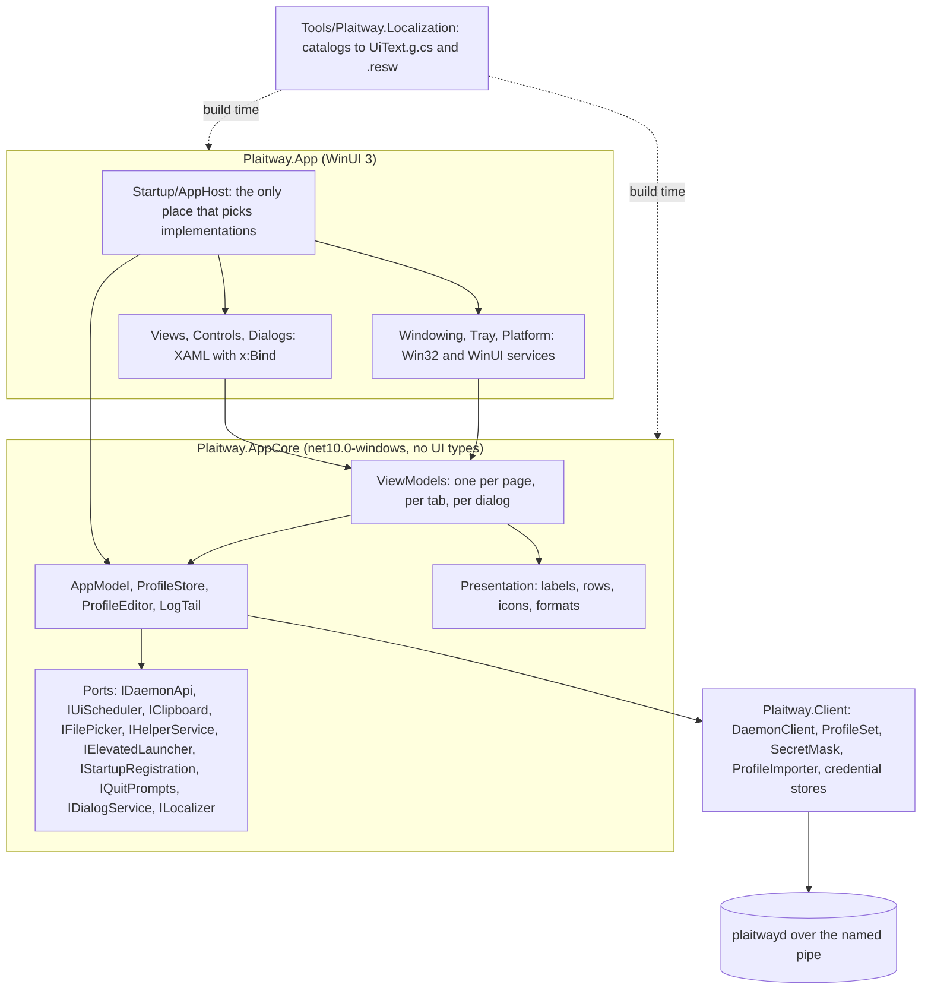
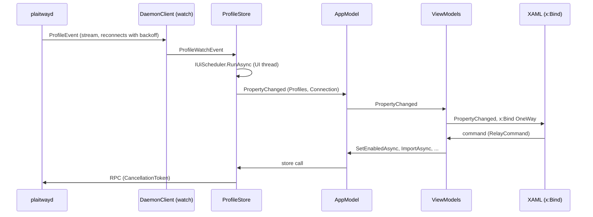
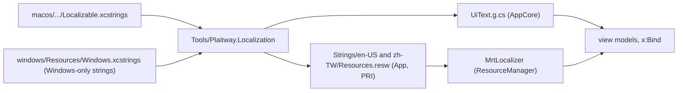

# Windows app: architecture of the interface

The app is `Plaitway.App` (WinUI 3, unpackaged, no WebView) on top of `Plaitway.AppCore` (the application model and the
view models, no WinUI) on top of `Plaitway.Client` (the daemon client). It does what `macos/Sources/PlaitwayMenuBar`
does, with the same words, and its behaviour is pinned by ports of the macOS tests (see
[the test mapping](#swift-tests-and-their-c-counterparts)).

## Layers



What each layer may know:

| Layer | May use | May not use |
|---|---|---|
| `Plaitway.Client` | gRPC, the pipe, Credential Manager | anything of the UI |
| `Plaitway.AppCore` | `Plaitway.Client`, `CommunityToolkit.Mvvm`, `Microsoft.Extensions.Logging.Abstractions`, the SCM and ShellExecute through its own ports | `Microsoft.UI.*`, `Windows.*` UI types, a dispatcher, a file dialog |
| `Plaitway.App` | everything above, WinUI | logic: a view wires a view model to controls and nothing more |

Every service that touches Windows is a port in AppCore with an implementation in App (or in AppCore when it has no UI,
as `ScmHelperService`) and a fake in the tests. `Startup/AppHost` is the composition root: it is the one place that
knows which implementation runs, and it makes everything the window shows. There is no static mutable state and no
service locator.

## Data flow



- The models and view models are bound to the UI thread. Anything that arrives from the pool (the watches, the RPCs)
  is marshalled through `IUiScheduler`, which the app implements with the `DispatcherQueue` and the tests with a
  single-thread `SynchronizationContext` (`UiThread`). Nothing in AppCore reaches for a dispatcher itself.
- Every asynchronous call takes a `CancellationToken`. A page's work (the log tail, the editor's read) starts in
  `IPageLifecycle.Activate` and ends in `Deactivate`.
- The daemon is the truth about profiles. The store keeps what it reported, in priority order; nothing is guessed
  ahead of it. `ProfileStore` answers credential requests itself (saved ones first, then the prompt) and keeps the
  Credential Manager in step with the profiles the daemon deletes.
- The shell chooses the page: `ShellViewModel.Page` is a `ProfilePageViewModel`, a `DiagnosticsViewModel`, an
  `AppSettingsViewModel` or an `EmptyProfilesViewModel`, made when the sidebar selects it and disposed when it leaves.
  While there is no helper to talk to, `SetupViewModel` takes the place of the whole window.

## The window

| Part | Where | Notes |
|---|---|---|
| Main window | `Windowing/MainWindow` | Mica, remembered size, position and maximised state on the right monitor (`WindowPlacementStore`, `window.json` in the data directory), minimum size, close hides to the tray |
| Single instance | `Startup/SingleInstance` | a named mutex and a named event, per user; a second start sets the event and ends. A copy that follows `PLAITWAY_SOCKET` (Debug builds) keys on the pipe, so a test run does not hand its window to the installed app |
| Sidebar | `Views/SidebarView`, `SidebarViewModel` | profiles with their state glyph, then Diagnostics and Settings; drag to reorder, Delete key and context menu |
| Profile page | `Views/ProfileView` | title, five tabs (`Pivot`), and the fixed bar at the bottom: Retry, Connect or Disconnect |
| Tray | `Tray/TrayIcon`, `AppCore/Tray` | a native menu built from `TrayEntry` rows, four state icons (idle, connecting, connected, attention) in a light and a dark variant, re-read when the theme or the DPI changes |
| Dialogs | `Dialogs/ContentDialogService` | one at a time (a semaphore); the credential prompt, the import report, and the questions (delete, quit, discard edits) |

There are no toasts: the macOS app posts no notifications either. There is no explanation of hide-to-tray on the first
close: macOS has none of that either.

## How to add a page

A page is a view model, a view and four small registrations.

1. **View model** in `Sources/Plaitway.AppCore/ViewModels/<Name>ViewModel.cs`: `ObservableObject`, state as
   `[ObservableProperty]`, actions as `[RelayCommand]`, strings through `UiText` (never a literal). If it holds
   something that needs starting and stopping, implement `IPageLifecycle`; if it holds subscriptions, `IDisposable`.
2. **View** in `Sources/Plaitway.App/Views/<Name>View.xaml` and its `.cs`: a `UserControl` with a `ViewModel`
   dependency property whose change callback calls `Bindings.Update()`, and `x:Bind` to it. Copy `AppSettingsView`.
3. **Template**: a `DataTemplate` for the view model type in `Views/ShellView.xaml`.
4. **Selector**: a property and a `switch` arm in `Views/PageTemplateSelector.cs`.
5. **Shell**: a `SidebarItem` (in `Navigation/Navigation.cs`) and a case in `ShellViewModel.ShowPage`, if the sidebar
   reaches it; a tab of a profile is a `ProfileSection` and a `PivotItem` in `ProfileView.xaml` instead.
6. **Tests** in `Tests/Plaitway.AppCore.Tests`: the view model against the real daemon (`AppHarness`), and the
   strings in both languages (`LocalizationTests` fails for a string that is missing or unused).

Look at the pages that exist before making a new control: `Controls/` holds the status glyph, tone text, the detail
rows and the sparkline, and `Styles/Common.xaml` the card, the type styles and the page layer.

## Conventions

- **Nullable, warnings as errors, `.editorconfig`, central package versions** (`Directory.Packages.props`). A build
  with a warning fails.
- **MVVM with CommunityToolkit.Mvvm.** No logic in code-behind beyond wiring a view to its view model: the
  exceptions are things only a control can do (the selection of a text box, scrolling a list, F6, the accelerators), and
  each says why in a comment.
- **Strings.** No user-visible string is written in XAML or in C#. Every string is a member of the generated `UiText`
  and bound as `{x:Bind ViewModel.Text.Retry}`; `LocalizationTests` scans the sources for a sentence, for a string
  that does not exist and for one nobody uses. The wording rules of the owner (labels are nouns, no personality in
  routine and error text, one label per action) are tests too.
- **Naming.** A view is `<Page>View`, its model `<Page>ViewModel`; a tab of a profile is `<Tab>View` and
  `<Tab>ViewModel` (the model derives from `ProfileTabViewModel`). A converter is a static function in `Controls/Bind`
  used as `{x:Bind controls:Bind.Visible(ViewModel.IsEmpty)}`; `x:Bind` functions cannot be generic and an indexer
  path (`Tabs[0].Label`) breaks the XAML compiler, so a view model exposes a property for each.
- **Logging.** `[LoggerMessage]` in `LogMessages.cs` (CA1848). Nothing secret is logged: no profile text, no
  credential, no token.
- **Errors** are worded once, in `ErrorText`, from the typed failures of the client, and reach the user as an
  `AppAlert` (a dialog) or as the text of the field that failed.

### Localisation pipeline

One source of truth, no hand-written resource file:



- `Tools\Localization.targets` runs the tool after the project references resolve; `GenerateUiText=true` (AppCore) and
  `GenerateResw=true` (App) choose what a project gets.
- A resource id is the English text in PascalCase (`Retry`, `DeleteProfileEllipsis`, `UploadQuestion`); `…` is
  `Ellipsis`, `?` is `Question`, `:` is `Colon`, `/` is `Per`. A string with arguments is a method
  (`SecretAppearsMoreThanOnce(long number)`).
- `%@`, `%lld`, `%1$@` and `%%` become `{0}`, `{1}` and `%`. A plural variation is refused with an error: say it with a
  count in the string instead, as the macOS catalog does. A key in both catalogs is an error.
- The language follows Windows. `--language en-US|zh-TW` or `PLAITWAY_LANGUAGE` overrides it (the screenshots use it).

## Resources and theming

- **Colours and brushes are theme resources.** `{ThemeResource TextFillColorSecondaryBrush}`, never a hex value, a named
  colour or `new SolidColorBrush`; a brush taken with `StaticResource` keeps the theme it was made in. State colours
  come from `StatusTone` (success, caution, critical, neutral, accent) mapped to theme brushes in `Controls/ToneText`
  and `StatusGlyph`. `InterfaceRulesTests` checks these.
- **State is never colour alone.** Every state has a glyph (Segoe Fluent Icons, see `Presentation/StatusVisuals`) and a
  word; the traffic chart tells received from sent by an area and a dashed line.
- **Light, dark and high contrast** come from the system theme; `--theme light|dark` forces one for the screenshots.
- **Layout** is a grid and stacks, not coordinates: no `Canvas`, margins and alignments are the ones that mirror under
  a right-to-left `FlowDirection`. A card has one width limit (`PageMaxWidth`) and the columns of a list are
  proportional (`3*`, `4*`) with a minimum for the one that holds a prefix.
- **Text scaling.** Text is a `TextBlock` in a flow layout, never in a fixed-height box; the type ramp styles scale with
  the Windows setting. Fixed font sizes are only on icon glyphs and on the monospace log and configuration text.

## Accessibility

- Every control that can be acted on or moved through has an accessible name: from its text, from its `Header`, or
  from `AutomationProperties.Name`. An icon button has `AutomationProperties.Name` and a tooltip with the same string.
  A list row names itself (`ProfileRowViewModel`, `RouteRow` and `LogEntry` override `ToString`, which is what a
  `ListViewItem` is named by).
- Everything is reachable by keyboard. The accelerators are on `ShellView` (`Ctrl+K` connect or disconnect the
  selected profile, `Ctrl+Shift+K` disconnect all, `Ctrl+I` import, `Ctrl+F` search the log, `Ctrl+Shift+D`
  Diagnostics, `Ctrl+,` Settings, `Ctrl+1` to `Ctrl+5` the tabs) and are not drawn as tooltips
  (`KeyboardAcceleratorPlacementMode="Hidden"`); **F6** and **Shift+F6** move the focus between the sidebar and the page.
- Dialogs focus their first input or the safe button; a question's default button is the one that cannot lose
  anything, and Escape is Cancel.
- A progress ring has a name; decorative glyphs are `AccessibilityView="Raw"`.

How it is checked:

| Check | Where |
|---|---|
| Names, theme and RTL rules readable from the sources | `Tests/Plaitway.AppCore.Tests/InterfaceRulesTests.cs` |
| Every control that needs a name in the running window has one, on every page | `Tests/Plaitway.App.UiTests` (`EveryControlThatCanBeActedOnHasAName`) |
| The same tree, as text, for review | `scripts\Dump-AutomationTree.ps1`, and `<page>-<theme>-<language>.txt` next to every screenshot |
| F6 moves the focus | `Tests/Plaitway.App.UiTests` (`F6MovesTheFocusBetweenTheSidebarAndThePage`). It sends a key, so it runs only while Windows lets the app have the keyboard, and is reported as skipped otherwise |
| Focus visuals, 200% text, high contrast | by eye, see below |

By eye, with the app running: tab through every page and look for a control with no focus rectangle; set
Settings > Accessibility > Text size to 200% and check that nothing is cut off; switch to a high-contrast theme and check
that every state is still told apart. These are not automated; they need a person.

## Helper setup

The helper is the Windows service `PlaitwayHelper` (the daemon). The app never starts it silently:

- `ScmHelperService` reads the service state through the Service Control Manager without elevation (not installed,
  stopped, running).
- `HelperLocator` finds `plaitwayd.exe` in one place, next to the app's directory (`..\plaitwayd.exe`).
- `HelperInstaller` runs `plaitwayd.exe install -start` (and `uninstall`, and the reinstall) through
  `ShellElevatedLauncher`, which is `ShellExecute` with the `runas` verb: Windows asks for consent once. A declined prompt
  is a decision, not an error.
- `DaemonSetup` reduces the connection, the service state, the versions and the executable to one `SetupKind`; the
  window shows `SetupView` for the ones that block it and a banner for the ones that do not.

**Nothing in the tests or the screenshots runs the elevated command.** The tests use `FakeHelperService` and
`FakeElevatedLauncher`; a Debug build that follows `PLAITWAY_SOCKET` uses `DisabledElevatedLauncher`.

## Where each page lives

| Page or part | View | View model | Also |
|---|---|---|---|
| Shell, banner, shortcuts | `Views/ShellView` | `ShellViewModel` | `Startup/AppHost`, `ShellViewModelTests` |
| Sidebar | `Views/SidebarView` | `SidebarViewModel`, `ProfileRowViewModel` | `Presentation/ProfileOrder` |
| Helper setup | `Views/SetupView` | `SetupViewModel` | `Helper/*`, `DaemonSetupTests` |
| No profiles | `Views/EmptyProfilesView` | `EmptyProfilesViewModel` | |
| A profile | `Views/ProfileView` | `ProfilePageViewModel` | the five tabs below |
| Overview | `Views/OverviewView` | `OverviewViewModel` | `Presentation/TrafficHistory`, `Controls/TrafficSparkline`, `Controls/DetailRows` |
| Routes and DNS | `Views/RoutesView` | `RoutesViewModel` | `Presentation/Rows` |
| Logs | `Views/LogsView` | `LogsViewModel` | `Logs/LogTail` |
| Configuration | `Views/ConfigurationView` | `ConfigurationViewModel` | `Editing/ProfileEditor`, `Editing/LineEndings`, `ProfileEditorTests` |
| Profile settings | `Views/ProfileSettingsView` | `ProfileSettingsViewModel` | |
| Diagnostics | `Views/DiagnosticsView` | `DiagnosticsViewModel` | `Pages/DiagnosticsModel`, `Presentation/DiagnosticsReport` |
| App settings | `Views/AppSettingsView` | `AppSettingsViewModel` | |
| Credentials | `Dialogs/CredentialDialog` | `CredentialPromptViewModel` | `Daemon/ProfileStore.Credentials`, `CredentialFlowTests` |
| Import report | `Dialogs/ImportReportDialog` | `ImportReportViewModel` | `AppModelImportTests` |
| Questions (delete, quit, discard) | `Dialogs/ContentDialogService` | `ChoiceRequest`, `QuitPrompts` | `AppCore/Dialogs`, `TrayAndDialogTests` |
| Tray | `Tray/TrayIcon`, `TrayIconSet` | `Tray/TrayViewModel`, `TrayMenuBuilder` | `Presentation/MenuModel`, `MenuModelTests` |
| Window | `Windowing/*`, `Win32Window` | | `Windowing/WindowPlacement` |

Two pages that edit the same thing do not both own it: the editor's text lives in `AppModel` (so a half-made edit
survives a visit to another profile), and the pages only show it.

## Swift tests and their C# counterparts

The macOS tests are the specification; each is ported to the xUnit test named here, with the same cases (the macOS
ones that need AppKit or SwiftUI have no counterpart and are listed after the table).

### `AppModelTests.swift` to `AppModelImportTests`, `AppModelTests`

| Swift | C# |
|---|---|
| importsDroppedFilesInlinesTheirReferencesAndSelectsTheLastProfile | `AppModelImportTests.ImportsDroppedFilesInlinesTheirReferencesAndSelectsTheLastProfile` |
| importsAProfileWhateverItsFileIsCalled | `AppModelImportTests.ImportsAProfileWhateverItsFileIsCalled` |
| reportsWhatWentWrongPerFile | `AppModelImportTests.ReportsWhatWentWrongPerFile` |
| aFailedImportSelectsNothing | `AppModelImportTests.AFailedImportSelectsNothing` |
| anAuthUserPassFileBecomesSavedCredentialsAndTheFirstConnectionDoesNotAsk | `AppModelImportTests.AnAuthUserPassFileBecomesSavedCredentialsAndTheFirstConnectionDoesNotAsk` |
| aProfileThatNamesAFileOutsideItsFolderIsRefusedAndNothingIsStored | `AppModelImportTests.AProfileThatNamesAFileOutsideItsFolderIsRefusedAndNothingIsStored` |
| theDaemonsReasonForRefusingAPkcs12ProfileIsShown | `AppModelImportTests.TheDaemonsReasonForRefusingAPkcs12ProfileIsShown` (needs the real engines; skipped without `PLAITWAY_REAL_DAEMON_TESTS=1`) |
| deletionAsksFirstAndThenSelectsAnotherProfile | `AppModelTests.DeletionAsksFirstAndThenSelectsAnotherProfile` |
| reconcilingKeepsASelectionThatStillExists | `AppModelTests.ReconcilingKeepsASelectionThatStillExists` |
| draggingAProfileSetsThePriorityOrder | `AppModelTests.DraggingAProfileSetsThePriorityOrder` |
| renamingTrimsAndIgnoresNothingNew | `AppModelTests.RenamingTrimsAndIgnoresNothingNew` |
| changingOneSettingKeepsTheOthers | `AppModelTests.ChangingOneSettingKeepsTheOthers` |
| aCallThatFailsBecomesAnAlert | `AppModelTests.ACallThatFailsBecomesAnAlert` |
| daemonFailuresAreWorded | `AppModelTests.DaemonFailuresAreWorded` |
| tracksTheHelperThroughItsStates | `AppModelTests.TracksTheHelperThroughItsStates`, `AStoppedServiceOffersToStartIt` |
| aFailedInstallIsReported | `AppModelTests.AFailedInstallIsReported`, `ADeclinedConsentPromptIsADecisionAndNotAnError`, `AHelperThatCannotBeFoundIsReportedAndNothingIsRun` |
| uninstallingGoesThroughTheInstaller | `AppModelTests.UninstallingGoesThroughTheInstaller` |
| aFailedInstallPointsToTheScriptThatInstallsWithoutApproval | `AppModelTests.AFailedInstallPointsToTheCommandThatInstallsFromAnElevatedShell` (the command is `plaitwayd.exe install -start`, not a script) |
| aDaemonThatAnswersWithoutHavingBeenRegisteredByTheAppIsLeftAlone (two registrations) | `AppModelTests.ADaemonThatAnswersWithoutHavingBeenInstalledByTheAppIsLeftAlone` (one: the service is installed or it is not) |
| aHelperTheAppRegisteredIsNotExternalAndIsReinstalledAfterTheConfirmation | `AppModelTests.AHelperTheAppInstalledIsNotExternalAndIsReinstalledAfterTheConfirmation` |
| aDaemonOfTheDeveloperOrOneThatIsDownIsNotAnExternalHelper | `AppModelTests.ADaemonOfTheDeveloperOrOneThatIsDownIsNotAnExternalHelper` |
| profilesThatAreOnAreWhatQuittingLeavesRunning | `AppModelTests.ProfilesThatAreOnAreWhatQuittingLeavesRunning`, `QuitAsksWhatToDoWithTheProfilesThatAreOn`, `QuitAsksBeforeEditsThatWereNotSavedAreLost` |
| aRefusedRenameSaysSoSoTheFieldCanGoBack | `AppModelTests.ARefusedRenameSaysSoSoTheFieldCanGoBack` |
| followsAProfilesLogAndStopsWhenCancelled | `AppModelTests.FollowsAProfilesLogAndStopsWhenCancelled` |
| aLogOfADeletedProfileEnds | `AppModelTests.ALogOfADeletedProfileEnds` |
| keepsTheNewestLogLinesWithinItsCapacity | `TrafficAndLogTests.KeepsTheNewestLogLinesWithinItsCapacity` |
| showsLinesThatComeTogetherInOneUpdate | `TrafficAndLogTests.ShowsLinesThatComeTogetherInOneUpdate` |
| readsDiagnosticsAndRefreshesAfterACommand | `AppModelTests.ReadsDiagnosticsAndRefreshesAfterACommand` |

Added for Windows: `ALaunchAtLoginThatCannotBeChangedIsReported` (the Run key), `AHelperThatCannotBeFoundIsReportedAndNothingIsRun`
(the helper file is missing from the install).

### `ModelTests.swift` to `DaemonSetupTests`, `MenuModelTests`, `PresentationTests`, `TrafficAndLogTests`

| Swift | C# |
|---|---|
| (resolves, with its cases) | `DaemonSetupTests.Resolves`, `AMismatchNamesBothVersions`, `ARunningServiceThatIsNotAnsweringKeepsTheReasonTheWatchGave` |
| onlyAnAnsweringDaemonIsUsable | `DaemonSetupTests.OnlyAnAnsweringDaemonIsUsable` |
| oneThingToDoPerState | `DaemonSetupTests.OneThingToDoPerState`, `RegisteringAgainIsOfferedOnlyWhereItCouldHelp` |
| anUnansweredHelperSaysWhereToLook | `DaemonSetupTests.AnUnansweredHelperSaysWhereToLook`, `AnAccountThatMayNotUseTheHelperIsToldSo` |
| onlyAMissingHelperOpensTheWindowAtLaunch | `DaemonSetupTests.OnlyAMissingHelperOpensTheWindowAtLaunch` |
| everyBlockedStateIsNamedInTheMenu | `DaemonSetupTests.EveryBlockedStateIsNamedInTheMenu`, `HasAnIconAndALabelInBothLanguages` |
| (aggregate state, with its cases) | `DaemonSetupTests.SummarisesTheProfiles` |
| aDaemonThatDoesNotAnswerHidesWhatTheProfilesSaid | `DaemonSetupTests.ADaemonThatDoesNotAnswerHidesWhatTheProfilesSaid` |
| listsTheProfilesInOrderWithTheirState | `MenuModelTests.ListsTheProfilesInOrderWithTheirState` |
| aRowDoesWhatItsProfileNeeds | `MenuModelTests.ARowDoesWhatItsProfileNeeds` |
| summarisesHowManyAreConnected | `MenuModelTests.SummarisesHowManyAreConnected` |
| offersDisconnectAllOnlyWhileSomethingIsSwitchedOn | `MenuModelTests.OffersDisconnectAllOnlyWhileSomethingIsSwitchedOn` |
| anOutOfDateHelperStillWorksAndSaysSo | `MenuModelTests.AnOutOfDateHelperStillWorksAndSaysSo` |
| disablesEverythingWhenTheHelperDoesNotAnswer | `MenuModelTests.DisablesEverythingWhenTheHelperDoesNotAnswer` |
| (the menu is rebuilt only for a change a person sees) | `MenuModelTests.TwoMenusThatListTheSameRowsAreEqualSoTheMenuIsNotRebuiltForANewByteCount` |
| movesProfilesLikeAListDrag, movesOneProfileByOnePlace | `PresentationTests.MovesProfilesLikeAListDrag`, `MovesOneProfileByOnePlace` |
| routeRowsShowStatesAndNameTheProfileThatShadows | `PresentationTests.RouteRowsShowStatesAndNameTheProfileThatShadows` |
| aDisconnectedProfileShowsTheRoutesItNames | `PresentationTests.ADisconnectedProfileShowsTheRoutesItNames` |
| dnsRowsTurnTheDotIntoEveryDomain | `PresentationTests.DnsRowsTurnTheDotIntoEveryDomain` |
| everyStateHasALabel | `PresentationTests.EveryStateHasALabel` |
| formatsByteCountsAndEndpoints | `PresentationTests.FormatsByteCountsAndEndpoints` |
| logLinesAreCopiedAsPlainText | `PresentationTests.LogLinesAreCopiedAsPlainText` |
| worksOutTheRatesFromTheCounters and the five that follow | `TrafficAndLogTests.WorksOutTheRatesFromTheCounters`, `ShowsTheMeanOfTheLastReadings`, `IgnoresASecondReadingForTheSameInterval`, `StartsAgainWhenACounterGoesDown`, `ForgetsAProfileThatIsNotConnected`, `KeepsTwoMinutes` |
| noTwoProfileStatesShareAShape | `PresentationTests.NoTwoProfileStatesShareAShape` |
| theSidebarUsesTheShieldsOfTheMenuBarItem | `PresentationTests.TheSidebarUsesTheShieldsOfTheTrayIcon` |
| aStandbyRouteIsNotPaintedAsAWarning | `PresentationTests.AStandbyRouteIsNotPaintedAsAWarning`, `EveryRouteStateHasItsOwnShape` |
| onlyAnEndingStateMoves | `PresentationTests.OnlyAnEndingStateMoves` |
| everyProfileSectionHasAName | `PresentationTests.EveryProfileSectionHasANameInBothLanguages` |
| formatsARateAndLeavesTheLogTimeTheSameWidth | `PresentationTests.FormatsARateAndLeavesTheLogTimeTheSameWidth` |
| listsWhatABugReportNeedsAndNoLogLines | `PresentationTests.ReportListsWhatABugReportNeedsAndNoLogLines` |

Not ported: `everyProfileStateHasASymbolThatExists` and `everyRouteStateHasASymbolThatExists` check SF Symbols names with
AppKit. The Windows glyphs were checked by rendering them (and `NoTwoProfileStatesShareAShape` keeps them apart).

### `ProfileEditorTests.swift` to `ProfileEditorTests`

Every Swift test has the C# test of the same name (`ShowsTheStoredTextWithItsSecretsHidden`, `SavesAnEditWithoutLosingTheSecret`,
`ASavedProfileThatIsOnKeepsTheOldTextUntilItReconnects`, `ShowsTheSecretsOnRequestAndHidesThemAgainWithTheEditsMadeMeanwhile`,
`ASecretTypedOverIsStoredAsTheNewSecret`, `ARefusedTextStaysInTheEditorAndIsMarkedAtItsLine`,
`ARefusalIsMarkedAtTheLineThePersonSees`, `APlaceholderThatStandsTwiceIsNotSent`, `RevertGoesBackToTheStoredText`,
`ALoadDoesNotThrowAwayEdits`, `AProfileThatIsGoneCannotBeRead`, `HidesTheSecretsAgainWhenThePageIsLeft`,
`ShowingOrHidingTheSecretsClearsAMarkThatNamedALineOfTheOtherView`, `AProfileThatConnectsAgainRunsTheSavedText`,
`TheModelKnowsOfEditsThatAreNotSaved`). Added for Windows, because a text box counts every line break as one `\r`
whatever the file used: `AFileWithWindowsLineEndingsIsNotDirtyUntilItIsChanged`,
`ATextBoxsLineBreaksAreTheSameTextAsTheStoredOnes`, `ASavedFileKeepsTheLineEndingsItHad`, and
`LineEndingsTests`. The editor works on `\n` and puts the file's own ending back when it stores the text.

### `LocalizationTests.swift` to `LocalizationTests`, `LocalizationToolTests`

| Swift | C# |
|---|---|
| everyStringTheSourcesUseIsInTheCatalog | the compiler (`UiText` has a member only for a string in both languages), `XamlBindsOnlyToStringsThatExist`, `TheScanOfTheSourcesFindsWhatItShould` |
| theCatalogHoldsNoStringNobodyUses | `EveryStringTheWindowsCatalogHoldsIsUsed` (the macOS catalog also holds strings only macOS shows) |
| noStringBypassesTheModuleBundle | `NoUserVisibleStringIsWrittenInXaml`, `NoSentenceIsWrittenInCSharp` |
| everyStringIsTranslatedIntoTraditionalChinese | `EveryStringIsTranslatedIntoTraditionalChineseWithTheSamePlaceholders`, `BothLanguagesHaveTheSameIdsAndNoEmptyString`, `ThePlaceholdersOfEveryStringFormatInBothLanguages` |
| theTranslationsUseTaiwanTerms | `TheTranslationsUseTaiwanTerms` |
| theTextCarriesNoPersonality | `TheTextCarriesNoPersonality`, `LabelsAreNounsAndShortStatesAndNeverQuestionsExceptWhereTheUserDecides` |
| theCompiledBundleHasTheTraditionalChineseStrings | `EveryMemberResolvesInBothLanguagesAndFormatsItsArguments`, `TheGeneratedClassHasAMemberForEveryStringOfTheCatalogs` |
| sameActionSameLabel | `SameActionSameLabel` |

Added: `TheCatalogsHaveNoStringInBoth`, `TheWordsOfTheMacAppAreTheWordsOfThisOne`, and the tool's own tests in
`LocalizationToolTests` (resource ids, specifiers, plurals refused).

## Run it

See [../README.md](../README.md) for the requirements. `global.json` (in `windows`) selects the Microsoft.Testing.Platform
runner, so the tests are run from there with `--project`.

```powershell
dotnet build windows\Plaitway.sln -c Release            # warnings are errors

cd windows
dotnet test --project Tests\Plaitway.AppCore.Tests -c Release   # view models, localisation, rules: against the real daemon, no windows
dotnet test --project Tests\Plaitway.App.UiTests                # starts the app and drives it: windows appear on screen
```

The UI tests build the Debug app (only a Debug build follows `PLAITWAY_SOCKET`), run it against `plaitwayd -fake` on a pipe
of their own, and look at it through UI Automation. They need an interactive desktop; they never touch the real service,
a route or a startup entry. One class, so one window at a time.

To look at the app by hand, against a fake daemon, see the README. Useful switches of the app (Debug builds):

| Switch | Effect |
|---|---|
| `--theme light\|dark` | forces the theme |
| `--language en-US\|zh-TW` (or `PLAITWAY_LANGUAGE`) | forces the language |
| `--bounds x,y,width,height` | places the window |
| `--topmost` | keeps it on top |
| `--hidden` | starts in the tray |
| `--data-dir <folder>` | where the window position and the log go |
| `PLAITWAY_SOCKET=\\.\pipe\<name>` | the daemon to talk to |
| `PLAITWAY_RUN_REPORT=<file>` | the app writes `tray_window=`, `tray_add=` and the time to first window there |

## Screenshots

```powershell
pwsh windows\scripts\capture-ui.ps1 -ArtifactsDirectory $env:TEMP\plaitway-ui [-Themes light,dark] [-Languages en-US,zh-TW] [-Build]
```

For every theme and language it starts a fake daemon with profiles in each state (two connected, one idle, one failed),
starts the app against it, selects every page and tab, opens the delete and quit questions, the credential dialog and
the setup screen, and writes `<page>-<theme>-<language>.png` and, next to it, the UI Automation tree
`<page>-<theme>-<language>.txt` with the list of controls that have no name. The picture is the window's own
(`PrintWindow`), so nothing else on the desktop can appear in it. The exit code is 1 when a control that needs a name has
none.

The script presses buttons and tabs through UI Automation. It sends keys only where it has no other way (Up and Enter in
the tray menu, to reach the question before quitting), and only while the app itself has the keyboard; otherwise that part
is skipped and the summary says so. Look at the pictures: the tree says what a screen reader hears, not that a column is
cut off.

The tray and application icons are generated from `Docs/app-icon.png` by `scripts\generate-icons.ps1`
(`Assets\Plaitway.ico`, `Assets\Tray\tray-<state>-<light|dark>.ico`, 16 to 48 px); run it when the artwork changes and
commit the icons.
